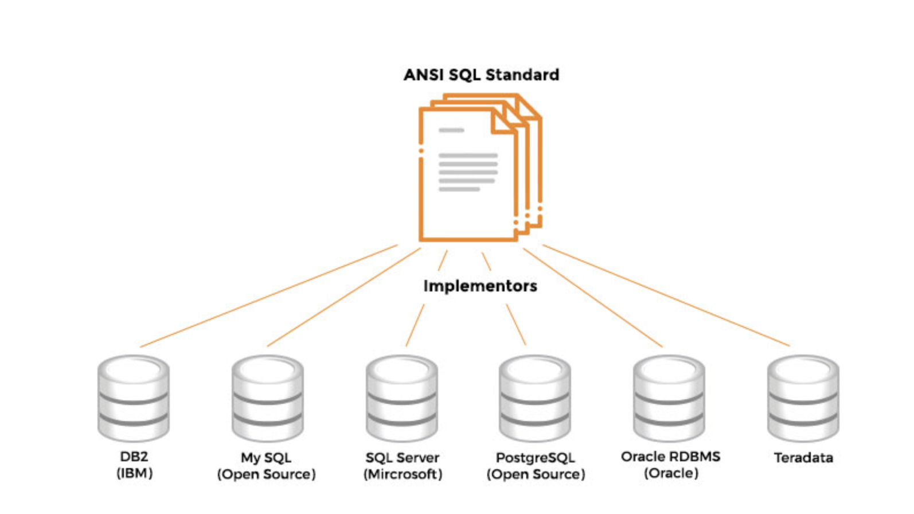
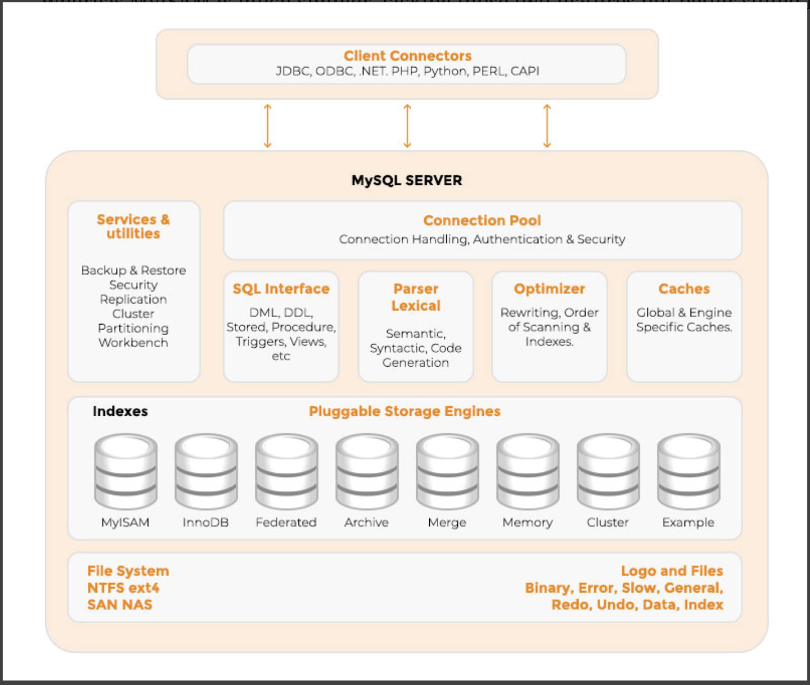

# ****Relational vs Non-Relational****

**Data Categories:**

- **Structured** → Data stored in SQL databases is structured. Structured data is usually formatted in a universally understandable and identifiable manner.
- **Unstructured** → Videos, audio, blogs, log files, social-media posts, etc, are all examples of unstructured data. It is data without any conceptual definition or type.
- **Semi-structured** → JSON and XML examples of Semi-structured data. it is data contains certain parts that are structured, and others that are not.

**Database Types:**

- **Relational or SQL Databases**
    - Relational databases consist of data stored as rows in tables.
    - Popular implementations include Oracle, DB2, Microsoft SQL Server, PostgreSQL, and MySQL.
    - There are three **layers** that we can divide MySQL into:
        1. **Application**/**Client** Layer
            - The application layer is responsible for client connections, authorization, authentication, and security.
        2. **MySQL Server** Layer
            - The server layer is responsible for parsing, analyzing, and optimizing submitted queries.
            - Maintains caches and buffers, recovery and backup partitioning.
            - The output of this layer is a query execution plan that is fed into the storage engine.
        3. **Storage Engine** Layer
            - Writes and retrieves data from the underlying physical storage medium.
            - **InnoDB** → Supports foreign key constraints and transactions
            - **MyISAM** → Much simpler, lacking those two features but better suited for single-user applications.

- **Non-Relational or NoSQL Databases**
    - The spectrum includes
        - **Key-value stores** (Redis, Amazon Dynamo DB).
        - **Column stores** (HBase, Cassandra).
        - **Document stores** (Mongo DB, Couchbase).
        - **Graph databases** (Neo4J), and search.
        - **Engines** (Solr, ElasticSearch, Splunk).

- **Big Data**
> Big Data usually includes data sets with sizes beyond the capability of traditional software tools (e.g., SQL technologies) to capture, curate, manage, and process data within a tolerable elapsed time.